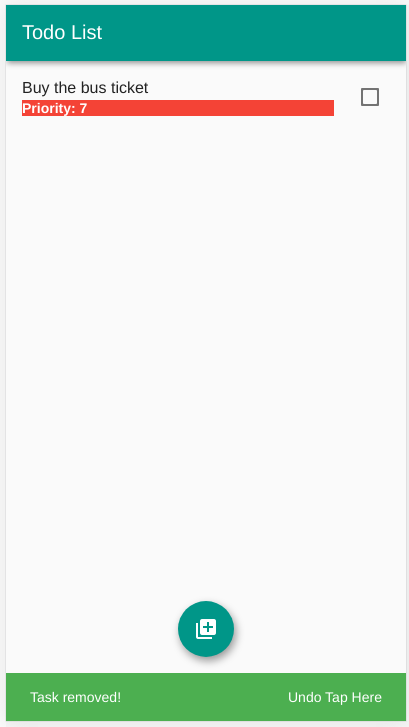
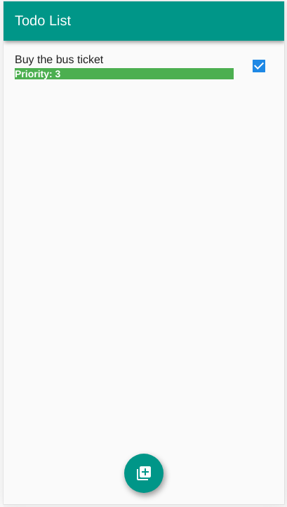

# Flutter A To Z

The goal is trying different flutter features, and apply CI/CD using github actions.

The latest version of the APP is available to try at https://hbgit.github.io/flutter_a_z/

# v1.0
---

## Hello World sample

- Some NOTES and steps are done to create and execute this project
```console
$ mkdir hello_app
$ cd hello_app
$ flutter create .
```

- Creating .github/worflows/dart.yml
- Setting up the https://codecov.io
- In .github/worflows/dart.yml , the APK generation adopts to generate a draft release
- Deploy the APK in the github pages, the site will be published as yourusername.github.io/repo-name
- Setting up SSH GitHub to deploy the APP
    - Check out https://github.com/JamesIves/github-pages-deploy-action using ssh 
    - Create a new SSH key pair for your repository. **WARNNING:** Do not set a passphrase https://help.github.com/en/github/authenticating-to-github/generating-a-new-ssh-key-and-adding-it-to-the-ssh-agent#generating-a-new-ssh-key
    - Copy the contents of the public key (.pub file) to a new repository deploy key and check the box to "Allow write access.":
    ```console 
    $ xclip -sel clip < ~/.ssh/deploy_key.pub
    ```
    - Add a secret (named SSH_PRIVATE_KEY) to the repository containing the entire contents of the private key, Using 
    ```console 
    $ xclip -sel clip < ~/.ssh/deploy_key
    ```
- Setting github pages
    - In order for your site to be published, a Jekyll theme must be chosen, even if you don't use Jekyll at all
    - Go to https://github.com/yourusername/repo-name/settings -> GitHub Pages -> Change theme

--- 

# v2.0
---
## Phrases of the Day

- The goal of this APP is showing random phrases in the screen according to the button is clicked

- The source code is available at: https://github.com/hbgit/flutter_a_z/tree/feature_phrase

- Some NOTES about this APP:
    - Plugin adopted in the Visual Code IDE: Flutter (Dart-Code); Awesome Flutter Snippets (Nash Ramdial); and Dart (Dart-Code)
    - We try: Image, RaisedButton, and dart:math 

- Update the test

- Overview of the APP: 
<center>

</center>

---

# v3.0
---
## Jokenpo

- The goal of this APP has created the game Jokenpo, i.e., rock, paper, and scissors

- The source code is available at: https://github.com/hbgit/flutter_a_z/tree/feature_jokenpo_app

- Some NOTES about this APP:
    - We adopt internal packages; AppBar on setState; and GestureDetector

- Overview of the APP:

| Start  | WIN  | LOST  | Same Result  |
|---|---|---|---|
| ||||
---

# v4.0
---
## Álcool VS Gasolina

- The goal of this APP is to decide the best choice analyzing the price of the Gasoline and Alcohol

- The source code is available at: https://github.com/hbgit/flutter_a_z/tree/feature_gasvsalco

- Some NOTES about this APP:
    - We adopt internal packages; SingleChildScrollView; and TextField;
    - We add unit test on test/unit_calcopt_test.dart
    - Noting that Dart tests are written using the flutter_test package's API, named with the suffix _test.dart, and placed inside the test/ subdirectory of the package under test.

- Overview of the APP:

| Start  | Alcohol  | Gasoline  | Incorrect Input  |
|---|---|---|---|
| ||||

---

# v5.0
---
## Coin Game

- The goal of this APP is to automatically choose one side of a coin

- The source code is available at: https://github.com/hbgit/flutter_a_z/tree/feature_gamecoin

- Some NOTES about this APP:
    - We adopt internal packages; and routes with MaterialPageRoute    

- Overview of the APP:

| Start  | Result 1  | Result 2  |
|---|---|---|
| |||

---

# v6.0
---
## Bitcoin Price

- The goal of this APP is to automatically show the price of the Bitcoin adopting an API.

- The source code is available at: https://github.com/hbgit/flutter_a_z/tree/feature_bitcoinprice

- Some NOTES about this APP:
    - We adopt internal packages; http.Response; async Functions; json.decode; and RoundedLoadingButton.

- Overview of the APP:

| Start  | Result 1  | Result 2  |
|---|---|---|
| |||

---

# v7.0
---
## YouTube Clone

- The goal of this APP is to adopt and simulate the YouTube APP based on a specific Playlist from YouTube service.

- The source code is available at: https://github.com/hbgit/flutter_a_z/tree/feature_youtubeclone

- In this APP was adopted:
    - Youtube API (https://developers.google.com/youtube/v3/docs/search/list)
    - Internal packages 
    - http.Response 
    - async Functions
    - json.decode
    - url_launcher/url_launcher
    - flutter/foundation
    - flutter_youtube/flutter_youtube
    - ListView
    - BoxDecoration
    - NetworkImage
    - SearchDelegate    

- Overview of the APP:

| Start  | Hot  | Highest Views  | A-Z by Title  | Search |
|---|---|---|---|---|
| |||||

---

# v8.0
---
## TODO List

- The goal of this APP is to organize a Todo List with multiple tasks with the option to: create, update, and delete a task.

- The source code is available at: https://github.com/hbgit/flutter_a_z/tree/feature_tasklist

- In this APP was adopted:    
    - Internal packages     
    - async Functions
    - json.decode
    - path_provider/path_provider
    - dart:io
    - Dismissible
    - SnackBar
    - CheckboxListTile
    - FloatingActionButton
    - Slider    

- Overview of the APP:

| Start  | Screen 0  | Screen 1  | Screen 2  | Screen 3 |
|---|---|---|---|---|
| |||||

| Screen 4  | Screen 5  | Screen 6  | Screen 7  | Screen 8 |
|---|---|---|---|---|
| |||||

---

# v9.0
---
## Music Player

- The goal of this APP is to generate a playlist adopting song from a given URL, and it provides a Player Music for each song. In this APP to simulate a web service, it's adopted a JSON file from APP assets.

- The source code is available at: https://github.com/hbgit/flutter_a_z/tree/feature_music_player

- In this APP was adopted:
    - interal packages
    - audioplayer/audioplayer
    - wave/wave
    - flutter/services
    - StreamSubscription
    - initState and dispose
    - async functions
    - SingleChildScrollView
    - ConstrainedBox
    - Expanded
    - Slider
    - CircularProgressIndicator
    - Card

- Overview of the APP:

| Start  | Screen 1  | Screen 2  | Screen 3  |
|---|---|---|---|
| ||||

---


# v10.0
---
## Keep Notes

- The goal of this APP is to generate a note system that allows the user to save a note with a title, description, and date. In the APP is possible to create, update, and remove notes.

- The source code is available at: https://github.com/hbgit/flutter_a_z/tree/feature_notes

- In this APP was adopted:
    - interal packages
    - intl/intl
    - intl/date_symbol_data_local
    - AlertDialog
    - FlatButton
    - SnackBar
    - Card
    - GestureDetector
    - FloatingActionButton
    - path/path
    - NoteControll._internal() : singleton design pattern
    - sqflite/sqflite: 1.3.0+1, Web is not supported, one solution is https://pub.dev/packages/moor

- Overview of the APP:

| Start  | Screen 0  | Screen 1  |
|---|---|---|
| |||

| Screen 2  | Screen 3  | Screen 4  |
|---|---|---|
| |||

---

