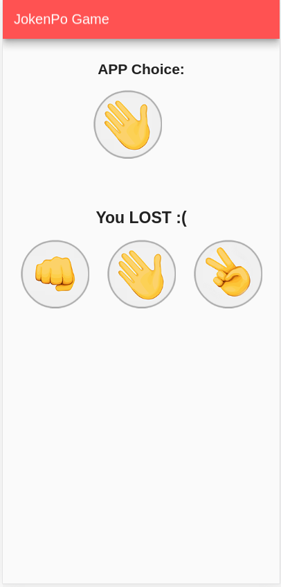
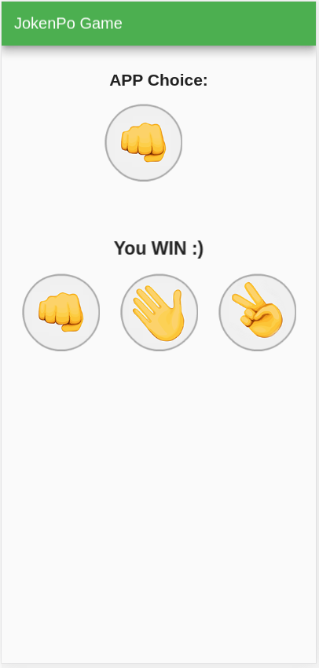

# Flutter A To Z

The goal is trying different flutter features, and apply CI/CD using github actions.

# v1.0
---

## Hello World sample

- Some NOTES and steps are done to create and execute this project
```console
$ mkdir hello_app
$ cd hello_app
$ flutter create .
```

- Creating .github/worflows/dart.yml
- Setting up the https://codecov.io
- In .github/worflows/dart.yml , the APK generation adopts to generate a draft release
- Deploy the APK in the github pages, the site will be published as yourusername.github.io/repo-name
- Setting up SSH GitHub to deploy the APP
    - Check out https://github.com/JamesIves/github-pages-deploy-action using ssh 
    - Create a new SSH key pair for your repository. **WARNNING:** Do not set a passphrase https://help.github.com/en/github/authenticating-to-github/generating-a-new-ssh-key-and-adding-it-to-the-ssh-agent#generating-a-new-ssh-key
    - Copy the contents of the public key (.pub file) to a new repository deploy key and check the box to "Allow write access.":
    ```console 
    $ xclip -sel clip < ~/.ssh/deploy_key.pub
    ```
    - Add a secret (named SSH_PRIVATE_KEY) to the repository containing the entire contents of the private key, Using 
    ```console 
    $ xclip -sel clip < ~/.ssh/deploy_key
    ```
- Setting github pages
    - In order for your site to be published, a Jekyll theme must be chosen, even if you don't use Jekyll at all
    - Go to https://github.com/yourusername/repo-name/settings -> GitHub Pages -> Change theme

--- 

# v2.0
---
## Phrases of the Day

- The goal of this APP is showing random phrases in the screen according to the button is clicked

- Some NOTES about this APP:
    - Plugin adopted in the Visual Code IDE: Flutter (Dart-Code); Awesome Flutter Snippets (Nash Ramdial); and Dart (Dart-Code)
    - We try: Image, RaisedButton, and dart:math 

- Update the test

- Overview of the APP: 
<center>

</center>

---

# v3.0
---
## Jokenpo

- The goal of this APP has created the game Jokenpo, i.e., rock, paper, and scissors

- Some NOTES about this APP:
    - We adopt internal packages; AppBar on setState; and GestureDetector

- Overview of the APP:

| Start  | WIN  | LOST  | Same Result  |
|---|---|---|---|
| ||||
---

# v4.0
---
## Álcool VS Gasolina

- The goal of this APP is to decide the best choice analyzing the price of the Gasoline and Alcohol

- Some NOTES about this APP:
    - We adopt internal packages; SingleChildScrollView; and TextField;
    - We add unit test on test/unit_calcopt_test.dart
    - Noting that Dart tests are written using the flutter_test package's API, named with the suffix _test.dart, and placed inside the test/ subdirectory of the package under test.

- Overview of the APP:

| Start  | Alcohol  | Gasoline  | Incorrect Input  |
|---|---|---|---|
| ||||

---

# v5.0
---
## Coin Game

- The goal of this APP is to automatically choose one side of a coin

- Some NOTES about this APP:
    - We adopt internal packages; and routes with MaterialPageRoute    

- Overview of the APP:

| Start  | Result 1  | Result 2  |
|---|---|---|
| |||

---

# v6.0
---
## Bitcoin Price

- The goal of this APP is to automatically show the price of the Bitcoin adopting an API.

- Some NOTES about this APP:
    - We adopt internal packages; http.Response; async Functions; json.decode; and RoundedLoadingButton.

- Overview of the APP:

| Start  | Result 1  | Result 2  |
|---|---|---|
| |||

---
